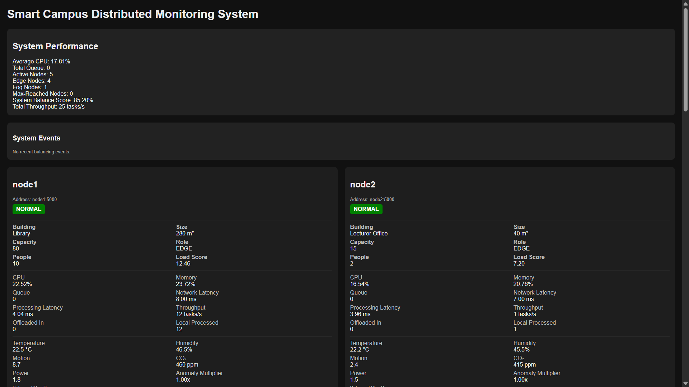

# 🧠 Smart Campus Distributed Load Balancing System

Welcome to the **Smart Campus Distributed System** project!  
This project simulates a **distributed edge–fog computing environment** where smart campus buildings dynamically manage computational workloads using environmental sensor data.

The system demonstrates how multiple nodes collaborate to **balance workloads before overload occurs**, ensuring stability and performance transparency in a distributed environment.

---

# 📸 Screenshots




---

# 🏗 System Architecture

The system simulates a **smart campus distributed computing environment** composed of several nodes.

| Node | Role | Location |
|-----|------|------|
| node1 | Edge Node | Library |
| node2 | Edge Node | Lecturer Office |
| node3 | Edge Node | Laboratory |
| node4 | Edge Node | Classroom |
| fog1 | Fog Node | Campus Fog Server |

## Edge Nodes

Edge nodes represent **smart buildings equipped with sensors**.  
Each node processes environmental data locally and generates workloads based on sensor readings.

## Fog Node

The fog node acts as a **central processing fallback server**.  
If edge nodes cannot handle additional workload, tasks are redirected to the fog node.

---

# 🌡 Sensor Simulation

Each building node simulates several environmental and activity sensors.

| Sensor | Description |
|------|------|
| People | Number of occupants in the building |
| Temperature | Indoor temperature level |
| Humidity | Air moisture level |
| CO₂ | Air quality level |
| Motion | Activity detection level |
| Power | Device energy consumption |

## Sensor Relationships

The sensors dynamically influence one another.

Examples:

- Increasing **people** increases **temperature, humidity, and CO₂**
- Higher **motion** increases **power consumption**
- Increased **power consumption** raises **temperature**

These interactions simulate **real smart building behaviour**.

---

# ⚠️ Node Status Types

Nodes can operate in several states.

| Status | Meaning |
|------|------|
| ACTIVE | Normal operation |
| MAX-REACHED | A sensor has reached its maximum threshold |
| BALANCING-SEND | Node sending workload to another node |
| RECEIVING | Node receiving workload from another node |
| FOG-RECEIVING | Fog server receiving excess workload |

---

# ⚖️ Load Balancing Strategy

The monitoring service continuously evaluates node performance using metrics such as:

- CPU usage
- Memory usage
- Queue length
- Sensor activity

When imbalance occurs:

1. The **node with highest load becomes the sender**
2. Nodes with lower load become **receivers**
3. Processing tasks are redistributed

If all edge nodes are heavily loaded, the **fog node receives the excess workload**.

---

# 🚀 Installation

Follow these steps to run the system locally.

## 1️⃣ Clone the Repository

```bash
git clone https://github.com/ynqabasikeyi/iot-edge-load-balancing.git
cd iot-edge-load-balancing


